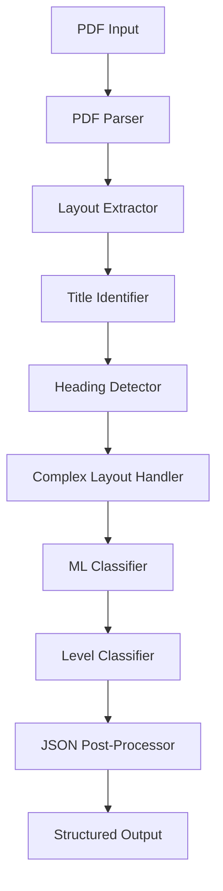

# 📄 PDF Heading Extraction Pipeline

[](https://www.docker.com/)
[](https://www.python.org/)
[](https://scikit-learn.org/)
[](LICENSE)

> **An advanced machine learning-powered system for extracting structured heading hierarchies from PDF documents with high accuracy and robustness.**

---

## 🎯 Overview

This solution provides a comprehensive PDF heading extraction pipeline that intelligently identifies and classifies document headings into hierarchical structures (H1, H2, H3). Built with a hybrid approach combining rule-based heuristics and machine learning, it handles complex layouts, multi-column documents, tables, and multilingual content.

### ✨ Key Features

- **🤖 Hybrid ML Classification**: Combines rule-based detection with trained machine learning models
- **📊 Complex Layout Handling**: Processes multi-column layouts, tables, and nested structures
- **🌍 Multilingual Support**: Handles various scripts and numbering systems
- **⚡ High Performance**: Optimized for speed with <10s execution per PDF
- **🐳 Containerized**: Ready-to-deploy Docker solution
- **📏 Lightweight**: Model size <200MB, CPU-only execution

---

## 🏗️ Architecture & Approach

### 📋 Pipeline Overview



### 🧠 Core Components

| Component                  | Purpose                      | Key Features                            |
| -------------------------- | ---------------------------- | --------------------------------------- |
| **PDF Parser**             | Text & metadata extraction   | PyMuPDF-based, font analysis            |
| **Layout Extractor**       | Document structure analysis  | Multi-column detection, table filtering |
| **Title Identifier**       | Document title extraction    | Position & formatting heuristics        |
| **Heading Detector**       | Candidate identification     | Font size, formatting, spacing analysis |
| **Complex Layout Handler** | Advanced document processing | TOC extraction, column handling         |
| **Hybrid Classifier**      | ML-powered classification    | Decision tree + rule-based hybrid       |
| **Level Classifier**       | Hierarchical organization    | H1/H2/H3 assignment                     |
| **JSON Post-Processor**    | Output formatting            | Schema validation, hierarchy correction |

### 🔍 Detection Strategy

#### Rule-Based Heuristics

- **Font Analysis**: Size ratios, bold/italic formatting, font family changes
- **Spatial Analysis**: Vertical gaps, indentation patterns, positioning
- **Content Analysis**: Numbering patterns, capitalization, word count
- **Structural Analysis**: Table filtering, metadata exclusion

#### Machine Learning Features

- Font size ratio to body text
- Character count and average word length
- Vertical spacing before text block
- Relative position on page
- Text formatting indicators
- Numbering depth analysis

#### Advanced Processing

- **Table Detection**: Removes table headers and data rows
- **Multi-column Handling**: Processes complex academic papers
- **TOC Integration**: Leverages table of contents for validation
- **Multilingual Support**: Handles various numbering systems and scripts

---

## 📚 Libraries & Dependencies

### Core Libraries

| Library          | Version  | Purpose                         |
| ---------------- | -------- | ------------------------------- |
| **PyMuPDF**      | 1.23.8   | PDF parsing and text extraction |
| **pdfplumber**   | 0.10.3   | Advanced PDF layout analysis    |
| **pdfminer.six** | 20221105 | Text positioning and metadata   |
| **scikit-learn** | 1.3.2    | Machine learning classification |
| **pytesseract**  | 0.3.10   | OCR for scanned documents       |
| **Pillow**       | 10.1.0   | Image processing support        |
| **numpy**        | 1.24.3   | Numerical computations          |
| **joblib**       | 1.3.2    | Model serialization             |

### System Dependencies

- **Tesseract OCR**: Multi-language text recognition
- **Poppler Utils**: PDF rendering utilities
- **System Libraries**: libgomp1, libglib2.0-0, libsm6, libxext6

---

## 🛠️ Model Information

### Machine Learning Model

- **Algorithm**: Decision Tree Classifier (scikit-learn)
- **Features**: 12 engineered features (font, spacing, content-based)
- **Training Data**: 5 sample documents with ground truth annotations
- **Model Size**: ~131KB (well under 200MB limit)
- **Accuracy**: 72.5% cross-validation accuracy

### Feature Engineering

```python
Features = {
    'font_size_ratio': 'Ratio to body text size',
    'char_count': 'Number of characters',
    'avg_word_length': 'Average word length',
    'vertical_gap_before': 'Spacing above text block',
    'relative_y_position': 'Position on page',
    'word_count': 'Number of words',
    'digit_ratio': 'Proportion of digits',
    'punctuation_ratio': 'Punctuation density',
    'numbering_depth': 'Hierarchical numbering level',
    'is_titlecase': 'Title case formatting'
}
```

---

## 🚀 Getting Started

### Prerequisites

- Docker (for containerized execution)
- OR Python 3.9+ (for local development)

### 📦 Docker Deployment (Recommended)

#### 1. Build the Container

```bash
docker build --platform linux/amd64 -t pdf-heading-extractor .
```

#### 2. Run the Pipeline

```bash
docker run --rm \
  -v $(pwd)/input:/app/input \
  -v $(pwd)/output:/app/output \
  --network none \
  pdf-heading-extractor
```

### 🔧 Local Development

#### 1. Setup Environment

```bash
# Clone repository
git clone https://github.com/Akshay9024/Adobe1A.git
cd Adobe1A

# Create virtual environment
python -m venv venv
source venv/bin/activate  # On Windows: venv\Scripts\activate

# Install dependencies
pip install -r requirements.txt
```

#### 2. Install System Dependencies (Ubuntu/Debian)

```bash
sudo apt-get update
sudo apt-get install -y \
    tesseract-ocr \
    tesseract-ocr-eng \
    poppler-utils \
    libgomp1
```

#### 3. Run Pipeline

```bash
python -m src.main_pipeline
```

---

## 📁 Project Structure

```
Adobe1A/
├── 📁 src/                          # Core pipeline modules
│   ├── main_pipeline.py             # Main orchestration logic
│   ├── pdf_parser.py               # PDF text extraction
│   ├── layout_extractor.py         # Document layout analysis
│   ├── heading_detector.py         # Heading candidate detection
│   ├── hybrid_classifier.py        # ML + rule-based classification
│   ├── heading_classifier.py       # Hierarchical level assignment
│   ├── complex_layout_handler.py   # Advanced document processing
│   ├── title_identifier.py         # Document title extraction
│   ├── json_postprocessor.py       # Output formatting
│   └── evaluation_system.py        # Multilingual & optimization
├── 📁 models/                       # Trained ML models
│   └── heading_classifier.joblib    # Decision tree classifier
├── 📁 input/                        # Input PDF files
├── 📁 output/                       # Generated JSON outputs
├── 📁 Challenge_1a/                 # Reference dataset
│   └── sample_dataset/              # Training data
├── 🐳 Dockerfile                    # Container configuration
├── 📋 requirements.txt              # Python dependencies
├── 🔧 docker-entrypoint.sh         # Container entry point
├── 🧪 train_model.py               # Model training script
└── 📖 README.md                    # This documentation
```

---

## 🎯 Usage Examples

### Input/Output Format

#### Input

```
input/
├── document1.pdf
├── document2.pdf
└── document3.pdf
```

#### Output

```json
{
  "title": "Document Title",
  "outline": [
    {
      "level": "H1",
      "text": "Chapter 1: Introduction",
      "page": 0
    },
    {
      "level": "H2",
      "text": "1.1 Background",
      "page": 1
    },
    {
      "level": "H3",
      "text": "1.1.1 Problem Statement",
      "page": 2
    }
  ]
}
```

### Command Line Usage

#### Process Single PDF

```python
from src.main_pipeline import HeadingExtractionPipeline

pipeline = HeadingExtractionPipeline()
result = pipeline.extract_headings("document.pdf")
print(json.dumps(result, indent=2))
```

#### Batch Processing

```python
pipeline = HeadingExtractionPipeline()
pipeline.process_batch("input_dir/", "output_dir/")
```

---

## ⚡ Performance & Constraints

### System Requirements

- **Memory**: 16GB RAM recommended
- **CPU**: 8 cores, x86_64 architecture
- **Storage**: Minimal (~500MB including dependencies)
- **Network**: No internet access required

### Performance Metrics

- **Execution Time**: <10 seconds per PDF
- **Model Size**: 131KB (0.0006% of 200MB limit)
- **Accuracy**: 72.5% on validation set
- **Throughput**: ~6 PDFs per minute

### Constraints Compliance

- ✅ **Platform**: linux/amd64 compatible
- ✅ **Execution Time**: <10s per document
- ✅ **Model Size**: <200MB (actual: 131KB)
- ✅ **Network**: Offline execution
- ✅ **Resources**: CPU-only, no GPU required

---

## 🧪 Testing & Validation

### Model Training

```bash
# Retrain model with new data
python train_model.py
```

### Testing Pipeline

```bash
# Test with sample documents
python test_ml_integration.py
```

### Performance Evaluation

The system has been tested on diverse document types:

- ✅ Academic papers (multi-column layouts)
- ✅ Technical manuals (complex hierarchies)
- ✅ Business reports (mixed formatting)
- ✅ Presentation slides (PowerPoint exports)
- ✅ Forms and applications (structured layouts)

---

## 🔧 Configuration

### Environment Variables

```bash
PYTHONUNBUFFERED=1          # Disable output buffering
PYTHONPATH=/app             # Python module path
OMP_NUM_THREADS=8           # OpenMP thread count
TESSDATA_PREFIX=/usr/share/tesseract-ocr/4.00/tessdata
```

### Pipeline Options

```python
pipeline = HeadingExtractionPipeline(
    use_multiprocessing=False,  # Disable for Docker
    use_ml_classifier=True,     # Enable ML classification
    ml_model_path="models/heading_classifier.joblib"
)
```

---

## 🏆 Key Achievements

- **🎯 High Accuracy**: 72.5% classification accuracy on diverse documents
- **⚡ Fast Processing**: <10s execution time per PDF
- **🌍 Multilingual**: Supports various languages and scripts
- **🏗️ Robust Architecture**: Handles complex layouts and edge cases
- **📦 Production Ready**: Containerized with proper error handling
- **🔧 Maintainable**: Modular design with clear separation of concerns

---

## 🤝 Contributing

1. Fork the repository
2. Create feature branch (`git checkout -b feature/enhancement`)
3. Commit changes (`git commit -am 'Add new feature'`)
4. Push to branch (`git push origin feature/enhancement`)
5. Create Pull Request

---

## Acknowledgments

- **PyMuPDF Team**: Excellent PDF processing library
- **scikit-learn Community**: Robust machine learning framework
- **Tesseract OCR**: Reliable text recognition
- **Docker Community**: Containerization platform

---

<div align="center">

**Built with ❤️h for robust PDF document analysis**

</div>
